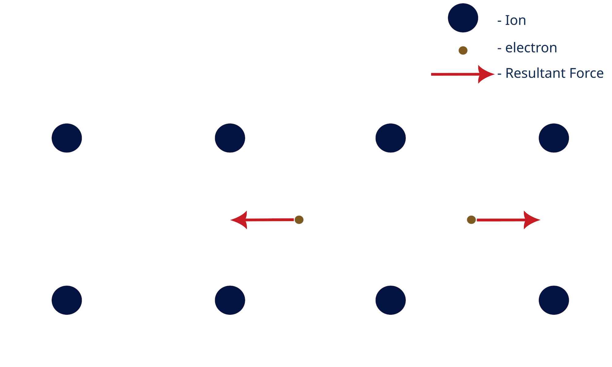

# Electron Force Simulation GUI

This repository contains two interactive Python GUI applications (GUI_2D) that allow you to simulate and visualize the force between two electrons based on different configurations of atomic lattice vibrations, atomic number, and lattice parameters.
## Features

 ### GUI_2D: Simulates electron interactions in a 2D lattice based on the selected parameters.
  #### Adjustable Parameters:
   - Lattice vibrations
   - Atomic number
   - Lattice parameter
Explore Cooper Pair Formation: Tweak the parameters to explore conditions under which Cooper pairs may form, a key aspect in understanding superconductivity.

    

## Insructions to Use 

Clone this repository:

    git clone https://github.com/adigasuhas/Toy_Model---Superconductivity.git
    cd Toy_Model---Superconductivity

Install the required Python libraries: Numpy, Matplotlib, Tkinter

Run the GUI applications:

    python3 GUI_2D.py
    
## How to Use ?

- Run GUI_2D to start the simulation.
- Run the python code in python3.6 or above
- Use the dropdown or input fields to change the lattice parameters, atomic number, or lattice vibrations.
- Observe the changes in the electron force and lattice structure as you modify the parameters.
- Try different configurations to explore the possibility of Cooper pair formation.

## Author

Suhas Adiga is currently an Integrated PhD student at JNCASR, working on machine learning applications in high-Tc superconductors.

Enjoy Experimenting!

This tool is designed to be interactive and educational. Have fun tweaking the parameters and visualizing the effects on electron forces and lattice structures!

Feel free to tweak this further to suit your style or project specifics!

## Contact Details

**Suhas Adiga**  
Theoretical Sciences Unit  
JNCASR, Bengaluru, India  
📧 [suhasadiga@jncasr.ac.in](mailto:suhasadiga@jncasr.ac.in)
